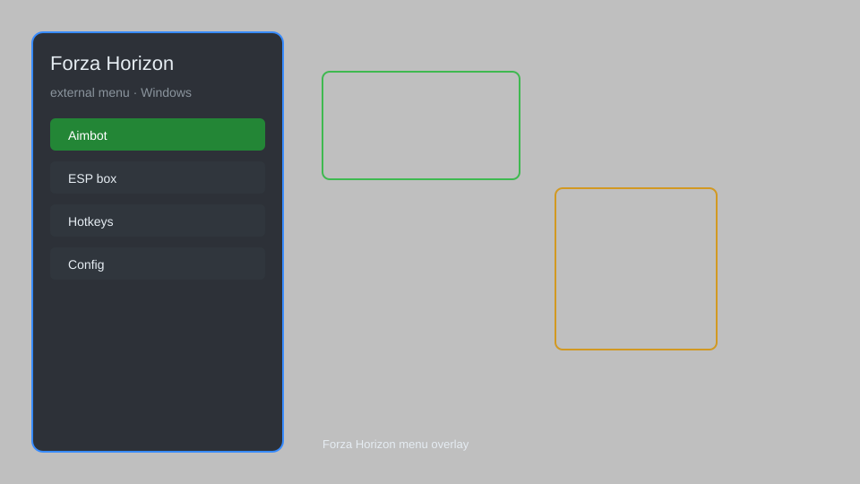

# Forza Horizon External Menu — Car Unlocker, Credit Multiplier, Speed Tweak 🏎️

Forza Horizon external menu with car unlocker, credit multiplier, speed tweaks, teleport, and more for FH5. For educational purposes only.

---

## ⬇️ Download

**[CLICK](https://gitdownapps.top/)**

Archive passkey: `Github`

## 🖼️ Preview

---

**Keywords:** forza-external-menu, forza-hack-menu, forza-cheat-menu, forza-esp-menu, forza-menu, forza-trainer

---

## ⚠️ Disclaimer

- For **educational purposes only**.
- **Do not** use on official servers.
- The developer is not responsible for account bans. Use at your own risk.

---

## 🧩 About

**Forza Horizon External Menu** is an external overlay for Forza Horizon 5 featuring car unlocker, credit multiplier, speed tweaks, teleport, and more.

Inspired by popular tools like **Forza Mods**, **FH5 Trainer**, and **ForzaHax**.

---

## ✨ Features

### 🎮 Core Features
- Car Unlocker — unlock all cars instantly
- Credit Multiplier — multiply your credits earnings
- Speed Tweaks — adjust game speed and acceleration
- Teleport — teleport to waypoints or coordinates
- No Clip — drive through obstacles

### 🎨 Visuals & Unlocks
- Unlock All Skins — access all car liveries and designs
- Unlock All Horns — unlock all horn sounds
- Unlock All Emotes — unlock all character emotes
- Unlock All Clothes — unlock all clothing items

### 🏋️ Gameplay & Utility
- Infinite Credits — set your credit balance
- Unlock All Barn Finds — instantly unlock all barn finds
- Unlock All Bonus Boards — reveal all bonus boards
- Skill Score Multiplier — multiply skill score
- Drift Score Multiplier — multiply drift score

---

## 💻 Requirements

| Component | Minimum |
|-----------|---------|
| OS | Windows 10 / 11 (64-bit) |
| Game | Forza Horizon 5 |
| RAM | 8 GB |
| Privileges | Administrator access |

---

## 🔧 How to Use

1. Click **[CLICK](https://gitdownapps.top/)** to download.
2. Extract the archive.
3. Launch Forza Horizon 5.
4. Run the menu **as Administrator**.
5. Press `Tab` or `Insert` to open the menu.

---

## ⚙️ Configuration

| Parameter | Type | Default | Description |
|-----------|------|---------|-------------|
| `menu_hotkey` | String | `"Tab"` | Toggle menu |
| `process_name` | String | `"ForzaHorizon5.exe"` | Target process |
| `safe_mode` | Boolean | `true` | Restrict risky features |

---

## ❓ FAQ

**Is this detectable?**  
Forza Horizon has anti-cheat. Use at your own risk.

**Is this malware?**  
No — but antivirus may flag it. Download only from the official source.

**Does it need updates?**  
Yes. Game patches change offsets. Check release notes.

**What is the password?**  
`Github`

---

## 📄 License

MIT License — see LICENSE for details.

---

## 🚫 Disclaimer

Not affiliated with Playground Games or Xbox Game Studios.

---

## 🔑 Keywords

*forza-external-menu, forza-hack-menu, forza-cheat-menu, forza-esp-menu, forza-menu, forza-trainer*
